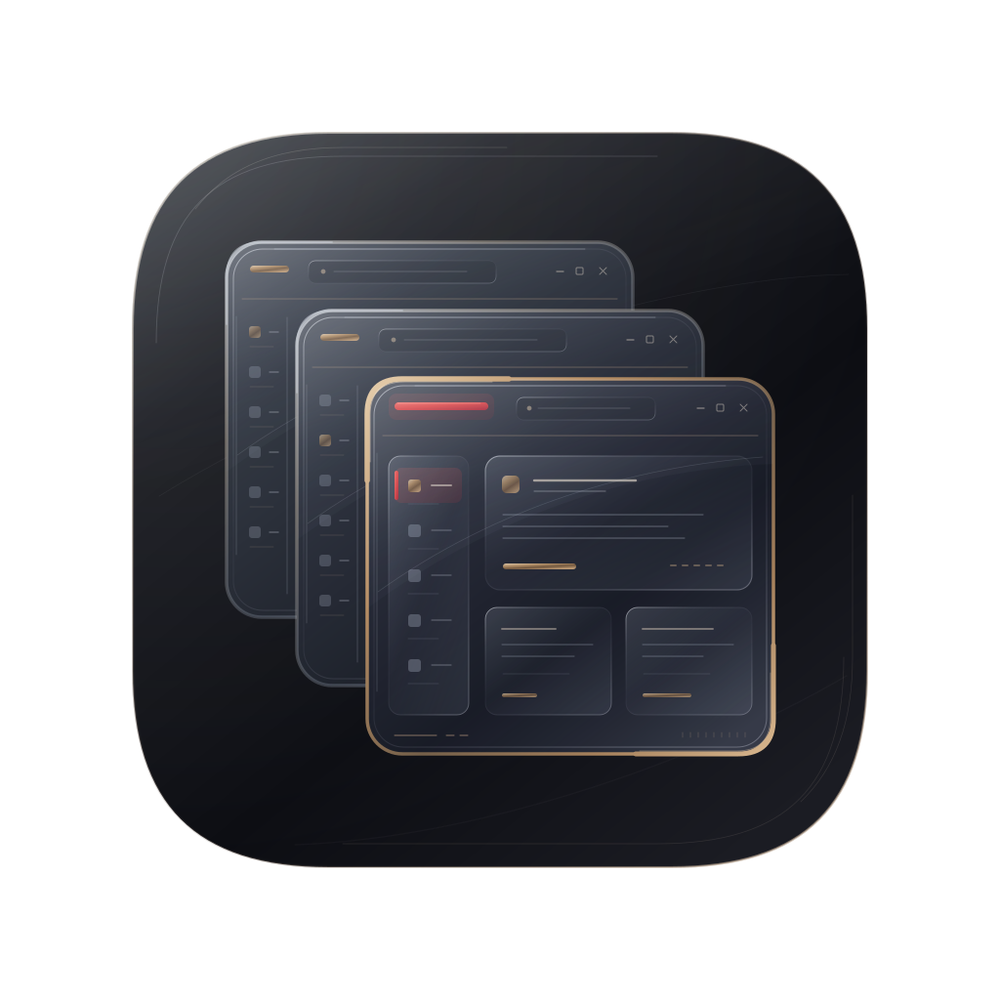

<!-- SPDX-License-Identifier: GPL-3.0-only -->

<div align="center">
  
  <h1>Alcove</h1>
  <p><strong>Любой сайт — отдельное приложение.</strong></p>
  <p>
    <a href="https://github.com/Cheviiot/Alcove/actions/workflows/ci.yml"></a>
    <a href="COPYING"></a>
    
    
  </p>
  <p><strong>Русский</strong> · <a href="README.en.md">English</a></p>
</div>

Alcove превращает корректный HTTP(S)-адрес в самостоятельное приложение для
рабочего стола GNOME. У каждого сайта собственный профиль, cookies, кэш,
разрешения и настройки. Общей браузерной оболочки нет, сессии разных сайтов не
пересекаются: вход в рабочую почту ничего не знает о личной.

## Возможности

- **Изоляция.** Отдельный профиль, хранилище и набор разрешений на каждый сайт.
- **Создание без сети.** Приложение создаётся, даже если название, значок или
  сам сайт сейчас недоступны — имя хоста можно ввести вручную.
- **Настройки по сайтам.** Навигация, прокси, фоновый режим, фильтры
  содержимого, строка user-agent.
- **Рабочие сценарии.** Окна OAuth, всплывающие окна, уведомления, загрузки.
- **Резервные копии.** Переносимые архивы; архивы с данными сайтов шифруются.
- **Минимум прав.** Доступ к системе только через порталы XDG, без выдачи
  приложению широких разрешений Flatpak.

## Два движка

| Движок | Роль |
| --- | --- |
| **WebKitGTK** | Родной для GNOME, используется по умолчанию. |
| **Chromium** | Дополнение для сайтов, которым WebKitGTK не хватает. |

Chromium поставляется отдельным дополнением Flatpak и **никогда не ставится
сам**. Выбор движка появляется только после установки дополнения и перезапуска.
Движок не меняется без подтверждения, а профили, cookies и авторизованные
сессии двух движков не смешиваются.

## Установка

Проект находится на версии 0.1.0, готовых выпусков пока нет. Рабочий способ —
сборка из исходников:

```sh
git clone https://github.com/Cheviiot/Alcove.git
cd alcove
flatpak-builder --disable-rofiles-fuse --user --install --force-clean \
  --install-deps-from=flathub .flatpak-build \
  build-aux/io.github.cheviiot.alcove.Devel.json
```

С первым выпуском появится подписанный репозиторий Flatpak, и установка
сведётся к одной команде с `alcove.flatpakref`; дальше — обычный
`flatpak update`. Подробности устройства репозитория — в
[packaging/README.md](packaging/README.md).

## Сборка и разработка

Зависимости живут в контейнере Distrobox `alcove-dev` на Fedora 44, а не в
основной системе. Создание контейнера и полный список пакетов — в
[CONTRIBUTING.md](CONTRIBUTING.md).

```sh
distrobox enter alcove-dev -- cargo fmt --check
distrobox enter alcove-dev -- cargo clippy --locked --all-targets -- -D warnings
distrobox enter alcove-dev -- cargo test --locked
distrobox enter alcove-dev -- meson setup build -Dui_tests=true
distrobox enter alcove-dev -- meson test -C build --print-errorlogs
```

Проверки интерфейса запускаются только в изолированной сессии Xvfb или Wayland
с собственными каталогами XDG и никогда не трогают установленные приложения
пользователя. Устройство экранов описано в [docs/gnome-hig.md](docs/gnome-hig.md).

## Приватность значков

Если сайт не отдаёт пригодный favicon, значок можно запросить через
[Icon Horse](https://icon.horse/). Запрос уходит **только по нажатию кнопки**,
наружу передаётся исключительно имя хоста, а нормализованный PNG сохраняется
локально. Без сети провайдер не нужен и не вызывается.

## Границы совместимости

Не поддерживаются и не входят в обещания проекта: DRM и Widevine, расширения
браузера, обход антибот-защиты, закрытые браузерные API.

## Происхождение и лицензия

Alcove — независимое продолжение [Spider](https://github.com/Zaedus/spider) от
коммита `dcf9d1080ce2bbd89c342b4766a94e18aaecf660`. Spider создан главным
образом Zaedus, с участием Cameron Radmore. История Git у Alcove начинается
заново и не содержит исходных коммитов Spider — они остаются в репозитории
Spider, а авторство унаследованного кода записано в [AUTHORS.md](AUTHORS.md).
Прежние авторы не участвуют в Alcove и не выражали его одобрения.

Лицензия — GPL-3.0-only. Подробности: [NOTICE](NOTICE), [AUTHORS.md](AUTHORS.md),
[COPYING](COPYING).

## Ещё

[Участие в разработке](CONTRIBUTING.md) ·
[Интерфейс](docs/gnome-hig.md) ·
[Модель угроз](docs/threat-model.md) ·
[Совместимость с порталами](docs/portal-compatibility.md) ·
[История изменений](CHANGELOG.md)
